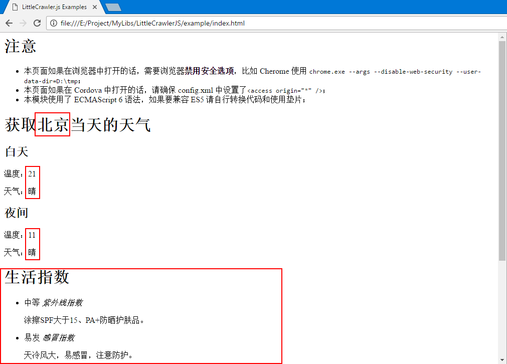

# LittleCrawlerJS

本模块是从本人的另一个项目 [ChDCReader](https://github.com/ChDC/ChDCReader) 中抽取出来的。主要用于爬虫。

本模块基于浏览器进行爬虫，不能用于 Node。

本模块的理念是把要爬取的操作写到配置文件中，然后调用该模块进行爬虫操作。这样实现了代码和配置的分离。

本模块只是一个简单的爬虫模块，不涉及代理、并发、数据清洗等操作。

## 注意

* 由于一般的浏览器都禁止了跨域请求访问，所以请在允许跨域请求访问的浏览器（如 Cordova 中）中运行本模块。

  或者禁用浏览器的安全选项。

  或者对没有跨域问题的网站进行爬虫操作。

## 简单的例子

#### 注意

* 本页面如果在浏览器中打开的话，需要浏览器**禁用安全选项**，比如 Cherome 使用 `chrome.exe --args --disable-web-security --user-data-dir=D:\tmp` ；
* 本页面如果在 Cordova 中打开的话，请确保 config.xml 中设置了 `<access origin="*" />`；
* 本模块使用了 ECMAScript 6 语法，如果要兼容 ES5 请自行转换代码和使用垫片；

该例子位于 [example](example/) 目录

```json
// 第一步：创建配置对象
let config = {
  request: "http://www.weather.com.cn/weather1d/101010100.shtml",
  response: {
    city: "body > div.con.today.clearfix > div.left.fl > div.ctop.clearfix > div.crumbs.fl > a",
    day: {
      temp: "#today > div.t > ul > li:nth-child(1) > p.tem > span",
      weather: "#today > div.t > ul > li:nth-child(1) > p.wea"
    },
    night: {
      temp: "#today > div.t > ul > li:nth-child(2) > p.tem > span",
      weather: "#today > div.t > ul > li:nth-child(2) > p.wea"
    },
    lifeHTML: "body > div.con.today.clearfix > div.left.fl > div.livezs"
  }
}

// 第二步：创建 LittleCrawler 对象
let lc = new LittleCrawler();

// 第三步：根据配置对象从服务器中获取到数据
/* {
  "city": "北京",
  "day": {
    "temp": "21",
    "weather": "晴"
  },
  "night": {
    "temp": "11",
    "weather": "晴"
  },
  "lifeHTML": "\n\t\t\t<div class=\"t clearfix\">\n\t\t\t\t<h1>生活指数</h1>\n\t\t\t</div>\n\t\t\t\t\t\t<script src=\"http://i.tq121.com.cn/j/weather2015/pagefilp.js\" type=\"text/javascript\"></script>\n<style>\n.pageflip {right: 0px; float: right; position: relative; top: 0px}\n .pageflip IMG {z-index: 99; right: -3px; width: 30px; position: absolute; top: -1px; height: 30px; ms-interpolation-mode: bicubic}\n .pageflip .msg_block {right: 0px; background: url(http://i.tq121.com.cn/i/weather2015/png/subscribe.png) no-repeat right top; overflow: hidden; width: 25px; position: absolute; top: 0px; height: 25px}\n</style>\n<input type=\"hidden\" id=\"zs_7d_update_time\" value=\"2017-05-05 14:00:00.0\">\n<ul class=\"clearfix\">\n<li class=\"li1 hot\">\n<i></i>\n<span>中等</span>\n<em>紫外线指数</em>\n<p>涂擦SPF大于15、PA+防晒护肤品。</p>\n</li>\n<li class=\"li2 hot\">\n<i></i>\n<span>易发</span>\n<em>感冒指数</em>\n<p>天冷风大，易感冒，注意防护。</p>\n</li>\n<li class=\"li3 hot\" id=\"chuanyi\">\n<a href=\"http://www.weather.com.cn/forecast/ct.shtml?areaid=101010100\">\n<div class=\"pageflip\">\n\n<div class=\"msg_block\">\n</div>\n</div>\n<i></i>\n<span>较舒适</span>\n<em>穿衣指数</em>\n<p>建议穿薄外套或牛仔裤等服装。</p>\n</a>\n</li>\n<li class=\"li4 hot\">\n<i></i>\n<span>较不宜</span>\n<em>洗车指数</em>\n<p>风力较大，洗车后会蒙上灰尘。</p>\n</li>\n<li class=\"li5 hot\">\n<i></i>\n<span>较不宜</span>\n<em>运动指数</em>\n<p>风力很强，推荐您进行室内运动。</p>\n</li>\n<li class=\"li6 hot\">\n<i></i>\n<span>优</span>\n<em>空气污染扩散指数</em>\n<p>气象条件非常有利于空气污染物扩散。</p>\n</li>\n</ul>\n\t\t\t\t\t"
} */
lc.get(config)
  .then(result => {
    // 第四步：将数据显示出来
    $('city').textContent = result.city;
    $('life').innerHTML = result.lifeHTML;
    for(let when of ["day", "night"]){
      let info = result[when];
      for(let item in info)
        $(`${when}.${item}`).textContent = info[item];
    }
  })
```

上面的 config 对象的 request 属性用于设置请求，如请求的URL、超时时间、超时重发次数、请求头（CordovaHTTP 插件支持）等。上面是最简单的配置：只设置了请求的URL。

config 对象的 response 属性用于对响应内容进行解析，一般是解析 HTML 文本，也支持解析 JSON 文本。

效果：



图中框住的就是获取到的数据。

## 用法

example 目录中有简单的例子，`src/LittleCrawler.test.js` 文件中有详细的测试用例可供参考。

配置对象主要由 request 和 response 两部分组成，一个用于配置请求，一个用于解析响应内容。

```json
{
  request: "http://www.weather.com.cn/weather1d/101010100.shtml",
  response: {
    city: "body > div.con.today.clearfix > div.left.fl > div.ctop.clearfix > div.crumbs.fl > a"
  }
}
```

### LittleCrawler 构造器和 get 方法

可以使用默认的参数创建 LittleCrawler 实例：

```js
let lc = new LittleCrawler();
```

也可以给构造器的第一个参数传递自定义的 ajax 操作对象：

```js
let ajax = (method, url, params, datatype, headers, options) => $.get(url, params, datatype); // 包装 jQuery get 方法
let lc = new LittleCrawler(ajax);

// 或者传入一个对象
let lc2 = new LittleCrawler({
  "myajax": ajax
})
```

不过本模块默认提供了两个 ajax 操作对象：一个缺省的 XHR 操作对象，一个使用 cordova-plugin-http 插件包装的 HTTP 请求对象。

可以在 request 配置对象中设置 ajax 属性为 cordova 指定使用 codovaHTTP 插件。或者显式的将 LittleCrawler.cordovaAjax 传递给构造器。

get() 方法用于根据配置对象从网页中获取信息：

```js
lc.get(config)
	.then(result => {
      
	});
```

get() 可以设置第二个参数，它是一个键值对对象，用于给函数内部提供可能用到的数据：

```js
let config = {
  request: "http://www.example.com",
  response: {
    type: "string",
    element: "#abc",
    valid: "{def} == 4"
  }
}
lc.get(config, {def: 4}) // 第二个参数给配置对象的 valid 操作提供了数据
```

### 配置请求

下面的代码展示了大部分可以用的选项：

```json
"request": {
  "url": "http://se.qidian.com/?kw={keyword}",
  "method": "GET",
  "ajax": "cordova",
  "params": "",
  "type": "html",
  "timeout": 15,
  "headers": {
  	"Referer": "http://se.qidian.com/",
  	"X-Requested-With": "XMLHttpRequest"
  }
}
```
其中：

* url: 指定请求的 URL

* method: 指定方法，缺省为 GET

* ajax: 设置用于发送请求的对象，缺省使用 XHR。可以指定值为 cordova，然后安装 `cordova-plugin-http` 插件然后使用 `cordova-plugin-http` 发送请求。

  也可以在 LittleCrawler 类的构造器中传入自定义的 ajax 对象。

* params: 指定请求参数

* type: 页面的类型，可为 HTML、JSON。缺省为 HTML

* timeout: 设置超时时间，缺省为 5s

* headers: 设置请求头。由于浏览器不支持设置请求头，所以目前只有 cordova-plugin-http 插件支持

### 配置响应的解析

响应的解析使用 response 属性设置。

### 响应配置类型

下面使用到的例子大部分都可以在 `LittleCrawler.test.js` 文件中找到。

#### 响应配置类型为单个字符串

最简单的就是用单个字符串设置要获取的对象：

```json
"response": "#content"
```

上面的 resonse 指定了一个 CSS 选择器，它会从 HTML 中解析出指定元素的 textContent 属性值。

#### 响应配置类型为 Object

或者使用一个对象来获取配置对象的每个值：

```json
"response": {
  "name": "#name",
  "age": "#age"
}
```

上面的配置会从页面中使用 CSS 选择器获取元素的内容并赋值给结果的 name 属性，age 属性也一样。

然后返回一个类似下面的结果对象：

```json
{
	"name": "张三",
    "age": "18"
}
```

#### 响应配置类型为 Array

或者使用一个对象来获取配置对象的每个值：

```json
"response": ["#name", "#age"]
```

上面的配置会从页面中使用 CSS 选择器获取元素的内容并赋值给结果数组的每个值。

然后返回一个类似下面的结果对象：

```json
["张三", "18"]
```

#### 响应配置类型为特殊的 Object

特殊的 Object 是指包含一个 type 键名的 Object。比如：

```json
"response": {
  "type": "string",
  "element": "#content",
  "attribute": "href"
}
```

特殊的 Object 用来配置一些复杂的操作。下面会讲到。

### 响应配置类型为特殊的 Object 的一些操作

#### 特殊 Object 支持的类型

特殊 Object 的 type 属性用来指定结果的类型。支持下面的值：

* array：结果对象为数组
* string：结果对象为字符串
* boolean：结果对象为布尔值
* format：结果是合成的结果
* object：结果对象为 Object，一般不常用。可直接设置配置对象为 Object 来代替，更加简单

#### type 属性为 array

type 属性设置为 array，则结果就是一个数组，可以使用 element 属性来指定 HTML 数组元素，并使用 children 来指定每个孩子的属性。

比如： 

```json
"response": {
  "type": "array",
  "element": "#books",
  "children": {
    "name": ".name",
    "author": ".author"
  }
}
```

上面的配置使用 element 获取 `#books` 这个元素，它一般是一个`<ul>`元素，然后对它的每个孩子元素进行操作，用 children 中指定的配置获取结果。

上面的配置会获取诸如下面的结果数组：

```json
[
  {
    "name": "你从我的世界走过",
    "author": "张三"
  },
  {
    "name": "哈利波特",
    "author": "李四"
  }
]
```

array 类型支持的操作：

* element: 指定 HTML 数组元素

* children: 指定如何从子节点中获取信息

* valid: 用于验证结果对象是否有效，如果无效则返回 undefined。它和下面的 valideach 属性相似，不过 valideach 一般用于筛选子节点。

* valideach: 用于验证每个孩子是否有效的 JS 代码

  比如上面的配置对象加上 valideach 属性获取的结果就不一样了：

  ```json
  "response": {
    "type": "array",
    "element": "#books",
    "children": {
      "name": ".bookname",
      "author": ".bookauthor"
    }
    "valideach": "!{author}.match('张三')"
  }
  ```

  书籍列表中作者是 `张三` 的书籍都会被过滤掉。

#### type 属性为 string

type 属性设置为 string，则结果就是一个字符串。

可以使用 element 属性来指定 HTML 元素，并使用 attribute 来指定获取元素的属性。一般这种操作常用特殊的属性名后缀来进行。

array 类型支持的操作：

* element: 指定 HTML 元素
* attribute: 获取指定元素的指定属性
* remove: 指定一个正则表达式，用来删除结果中匹配的一些不必要的内容
* extract: 指定一个正则表达式，用来结果中提取匹配的结果作为最终结果
* valid: 用于验证结果对象是否有效，如果无效则返回 undefined

##### 使用 attribute 操作获取指定元素的指定属性

可以使用下面的配置获取指定元素的指定属性：

```json
"response": {
  "type": "string",
  "element": "#content",
  "attribute": "href"
}
```

上面的配置使用

* `type` 属性显示的指定了获取的结果对象为字符串。必须指定 type 属性。
* `element` 属性用于设置选择器来获取指定的元素；
* `attribute` 属性用于设置获取指定元素的属性。

上面的配置会获取诸如下面的结果字符串：

```json
"http://www.google.com.hk/"
```

##### 使用 valid 操作验证结果

可以使用下面的配置获取指定元素的指定属性：

```json
"response": {
  "type": "string",
  "element": "#content",
  "attribute": "data-title",
  "valid": "{value} != '书籍列表'"
}
```

上面的结果没有通过验证所以会返回 undefined。

上面的配置使用

* `type` 属性显示的指定了获取的结果对象为字符串。必须指定 type 属性。
* `element` 属性用于设置选择器来获取指定的元素；
* `attribute` 属性用于设置获取指定元素的属性
* `valie` 属性用于过滤结果，使用 `{}` 括住属性的名字来使用属性的值，其中 `{value}` 表示当前的结果

##### 使用 remove 操作清洗数据

可以使用下面的配置获取指定元素的指定属性：

```json
"response": {
  "type": "string",
  "element": "#books > book:first-child > p.desc",
  "remove": "\\d+"
}
```

上面的 remove 属性会删除结果字符串中的英文字母和数字。

上面的配置使用

* `type` 属性显示的指定了获取的结果对象为字符串。必须指定 type 属性。

* `element` 属性用于设置选择器来获取指定的元素；

* `remove` 属性指定一个正则表达式，用来删除结果中匹配的一些不必要的内容。

  缺省会删除所有的匹配并忽略大小写。不过可以将 remove 设置为对象来指定选项：

  ```json
  "remove": { 
    "regexp": "\\d+",
    "options" "i"
  }
  ```

  也可以设置为一个字符串数组，然后按顺序依次删除：

  ```json
  "remove": ["\\w+", "^."]
  ```

##### 使用 extract 操作提取最终结果

可以使用下面的配置获取指定元素的指定属性：

```json
"response": {
  "type": "string",
  "element": "#books > li:nth-child(1) > p.desc",
  "extract": "\\d+"
}
```

上面的配置会提取结果字符串中第一个匹配的数字字符串。

上面的配置使用

* `type` 属性显示的指定了获取的结果对象为字符串。必须指定 type 属性。

* `element` 属性用于设置选择器来获取指定的元素；

* `extract` 指定一个正则表达式，用来结果中提取匹配的结果作为最终结果

  默认没有启用了 g 选项。

  如果启用了 g 选项会把所有匹配的结果连接起来作为最终结果；

  如果没有使用 g 选项且正则表达式中使用了分组，则把结果的分组合并为结果；

  也可以使用数组进行逐步提取操作

#### type 属性为 boolean

type 属性设置为 boolean，则结果就是一个布尔值。

boolean 类型支持的属性：

* element: 指定 HTML 数组元素
* true: 指定一个正则表达式，如果结果匹配正则表达式则返回 true
* false: 指定一个正则表达式，如果结果匹配正则表达式则返回 false
* default: true 或者 false，默认返回的值

例如：

```json
"response": {
  "type": "boolean",
  "element": ".comic-update",
  "true": "更新",
  "false": "全",
  "default": false
}
```

#### type 属性为 format

type 属性设置为 format，则结果就是一个用当前信息合成的字符串。

format 类型支持的属性：

* value: 指定合成字符串的规则

例如：

```json
"response": {
  "coverid": {
    "type": "string",
    "element": "cover",
    "extract": "(\\d\\d\\d)$"
  },
  "coverImg": {
    "type": "format",
    "value": "http://wfqqreader.3g.qq.com/cover/{coverid}.jpg"
  }
}
```

上面的配置使用 coverid 合成了 coverImg 的值。

#### type 属性为其他值

如果将 type 属性设置为非法的值，则该特殊的 Object 会被当成一个普通的 Object 对待。会根据该 Object 的每个 Entry 来获取结果。


### 一些特殊规则

#### 使用特殊的属性名获取指定的属性

上面用于获取 href 属性的例子写起来挺麻烦的，可以使用带特殊后缀的属性名来获取一些特殊的属性。

比如使用 link 结尾的属性名获取 href 属性值：

```json
"response": {
  "hostLink": "#content"
}
```

上面的配置会把匹配 `#content` 选择器的元素的 href 属性值返回给结果对象的 hostLink 属性。

上面的配置会获取诸如下面的结果对象：

```json
{
  "hostLink": "http://www.google.com.hk/"
}
```

目前支持的特殊属性名后缀有：

| 后缀          | 指定获取的元素属性   |
| ----------- | ----------- |
| 缺省          | textContent |
| link        | href        |
| img 或 image | src         |
| html        | innerHTML   |

### 响应数据为 JSON 数据

本模块也对解析 JSON 格式的数据有一定的支持。

支持一些操作：

* filter：用来过滤数组成员，可以传递一个参数。该参数用来指明过滤规则，在规则中用 `$element` 指代当前元素，用 `$parent` 指代父亲元素。
* concat：用来将一个二维数组连接成一个一维数组

下面用例子来说明它的用法：

例子使用的数据参见：[LittleCrawler.test.data.json](test/LittleCrawler.test.data.json)

```json
let response = "data.chapterTotalCnt";
equal(788, lc.parse(json, "json", response));

// 如果中间有属性是数组，自动遍历数组中的每个元素
response = "data.vs.cCnt";
equal("[13,10,10,10]", JSON.stringify(lc.parse(json, "json", response)));

// 在数组中使用 concat 操作把二维数组连接成一维数组
response = "data.vs.cs#concat.id";
equal("[2333784,2403463,4325986,20322705,1698931,2393792,2393793,2393794,2393796,2393822,2393823,2393859,2393864,2393869]", JSON.stringify(lc.parse(json, "json", response)));

// concat 操作要在子数组中使用，不是在父亲数组中
response = "data.vs#concat.cs.id";
equal("[[2333784,2403463,4325986,20322705],[1698931,2393792,2393793,2393794,2393796],[2393822,2393823],[2393859,2393864,2393869]]", JSON.stringify(lc.parse(json, "json", response)));

response = "data.vs.cs.id";
equal("[[2333784,2403463,4325986,20322705],[1698931,2393792,2393793,2393794,2393796],[2393822,2393823],[2393859,2393864,2393869]]", JSON.stringify(lc.parse(json, "json", response)));

// 可一对数组使用索引来获取指定索引的元素
response = "data.vs.1.cs.id"; // 只获取第一卷的数据
equal("[1698931,2393792,2393793,2393794,2393796]", JSON.stringify(lc.parse(json, "json", response)));
```


下面的例子用来获取起点中《神墓》的目录：

```js
let config = {
  "request": {
    "url": "http://book.qidian.com/ajax/book/category?_csrfToken=&bookId=63856",
    "timeout": 15,
    "type": "JSON"
  },
  "response": {
    "type": "array",
    "element": "data::vs::cs#filter(\"$parent.vN.indexOf(\\\"相关\\\") < 0\")#concat",
    "children": {
      "name": "cN",
      "linkid": "cU",
      "link": {
        "type": "format",
        "value": "http://read.qidian.com/chapter/{linkid}"
      }
    }
  }
}
return lc.get(config)
  .then(r => {
  equal('第一章 远古神墓', r[0].name);
  assert.lengthOf(r[0].link.match(/^http/), 1);
});
```

### 其他函数的使用

#### parse()

```js
parse(data, type, response, host, dict={})
```

根据配置对象解析结果，不进行 ajax 请求，所以它是个同步函数。

参数：

* data：需要解析的数据
* type：数据的类型，可为 JSON 或 HTML，缺省为 JSON
* response：response 配置对象
* host：用于修复获取的值中的 URL 的网站链接，如将诸如`/submit.php` 修复为 `http://www.example.com/submit.php`。如果不需要修复 URL，可为空。
* dict：给内部提供数据的键值对

例如：

```js
let html = "<div id="content">abc</div>"
let response = '#content';
parse(html, "html", response) // -> 'abc'
```

#### LittleCrawler.format()

用于格式化字符串：

```js
LittleCrawler.format("{m}def", {m: "abc"}); // -> 'abcdef'
```

